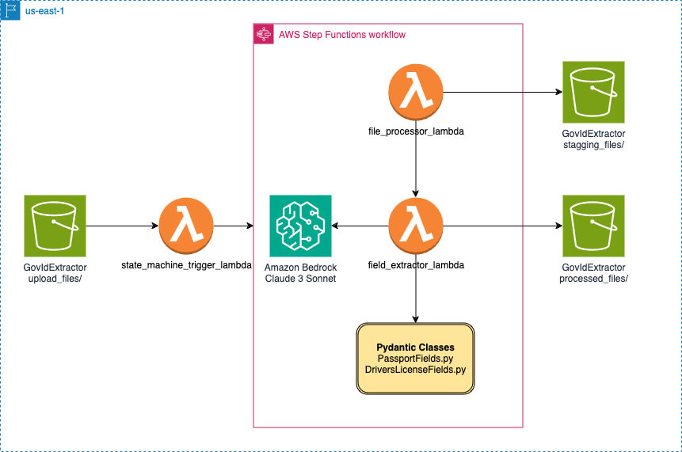

# Information Extraction Using Anthropic Function Calling on Bedrock CDK Stack

This is a CDK Python project that sets up an infrastructure for extracting information from PDF and JPEG files using AWS Lambda functions and Step Functions. It leverages the Anthropic Claude AI model running on Amazon Bedrock to extract specific fields from the files.

## Architecture



The architecture diagram showcases an AWS Step Functions workflow designed for processing government ID such as Driver's license, Passports, Voters id card etc files and extracting relevant fields using the Anthropic Claude Sonnet-3 AI model running on Amazon Bedrock. The workflow consists of the following key components:

1. **GovIdExtractorBucket**: An S3 bucket that stores the uploaded government ID files (PDFs or JPEGs) for processing under directory `upload_files`.

2. **state_machine_trigger_lambda**: A Lambda function that triggers the Step Functions workflow whenever a new file is uploaded to the GovIdExtractorBucket.

3. **AWS Step Functions Workflow**:
   - **file_processor_lambda**: This Lambda function handles the files (PDFs or JPEGs) uploaded by the user. It converts these files to JPEG format and stores them in the `stagging_files/` folder within the GovIdExtractorBucket S3 bucket.
   - **field_extractor_lambda**: This AWS Lambda function leverages the Claude AI model from Anthropic to process JPEG files located in the `staging_files/` folder of an S3 bucket. It extracts specific fields or information from government ID documents using the advanced capabilities of the Claude AI model. The extracted data is then formatted into JSON and saved in the `processed_files/` folder within the same S3 bucket. The function utilizes Anthropic's function calling and tool use features, alongside Pydantic classes, to ensure precise extraction of the required information from the government ID documents.

4. **Pydantic Classes**: Custom Pydantic classes are used for defining the data models for various fields, such as PassportFields.py and DriversLicenseFields.py.

The workflow is initiated when a new government ID file (PDF or JPEG) is uploaded to the GovIdExtractorBucket. The `state_machine_trigger_lambda` detects this event and triggers the Step Functions workflow. The `file_processor_lambda processes` the uploaded file and stores it in the `GovIdExtractor` bucket. Next, the `field_extractor_lambda` invokes the Claude AI model running on Amazon Bedrock to extract specific fields from the processed file. The extracted fields are then mapped to the corresponding Pydantic classes for data modeling and further processing and storage.

Overall, this architecture leverages AWS services, including Amazon S3, AWS Lambda, Step Functions, and Amazon Bedrock, along with the Anthropic Claude AI model, to automate the process of extracting relevant information from government ID documents.

## Prerequisites

Before deploying the stack, ensure that you have the following:

- [AWS CDK](https://aws.amazon.com/cdk/) installed and configured on your machine.
- [Docker](https://www.docker.com/) installed and running on your machine.
- An AWS account with appropriate permissions to create and manage the required resources.

## Deployment

To deploy the stack, follow these steps:
Here's an improved and aligned version of the instructions:

1. **Clone the repository:**

   ```sh
   git clone https://github.com/aws-samples/information-extraction-using-anthropic-function-calling-on-bedrock-cdk.git
   cd information-extraction-using-anthropic-function-calling-on-bedrock-cdk
   ```

   *Optional:* You can shorten the folder name to have more space in the CLI. Replace `/PATH/TO/REPOSITORY` with the actual path to the cloned repository folder:

   ```sh
   ln -s /PATH/TO/REPOSITORY/information-extraction-using-anthropic-function-calling-on-bedrock-cdk ~/shortcut
   cd ~/shortcut
   ```

2. **Manually create a virtual environment on macOS and Linux:**

   ```sh
   python3 -m venv .venv
   ```

   After the initialization process completes and the virtual environment is created, activate it:

   ```sh
   source .venv/bin/activate
   ```

   If you are on a Windows platform, activate the virtual environment like this:

   ```sh
   .venv\Scripts\activate.bat
   ```

3. **Install the required dependencies:**

   ```sh
   pip install -r requirements.txt
   ```

4. **Bootstrap the CDK environment (if not done before):**

   ```sh
   cdk bootstrap aws://ACCOUNT-NUMBER/REGION
   ```

   Replace `ACCOUNT-NUMBER` and `REGION` with your AWS account number and the desired AWS region.

5. **Deploy the stack:**

   ```sh
   cdk deploy
   ```

   This command will package and deploy the CDK stack to your AWS account.

## Usage

Once the deployment is complete, you can upload PDF or JPEG files to the `GovIdExtractorBucket` S3 bucket. The name of this bucket will be displayed in the CloudFormation output. Make sure to place the files under the `upload_files` folder within the bucket. Samples files are given in `sample_dataset` folder. As soon as a new file is added to this folder, the Step Function will automatically initiate the file processing and field extraction workflows.

## Cleanup

To delete the stack and all associated resources, run the following command:

```
cdk destroy
```


## Security

See [CONTRIBUTING](CONTRIBUTING.md#security-issue-notifications) for more information.

## License

This library is licensed under the MIT-0 License. See the LICENSE file.